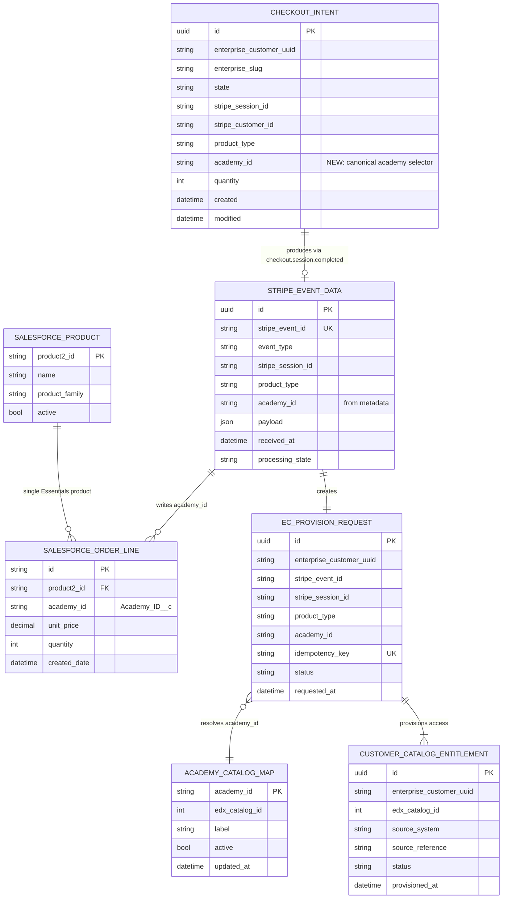

# Essentials Academy ERD (2026-04)

This ERD extends the Teams self-service billing model to support Essentials academy-aware provisioning while retaining a single Salesforce product.

## Key Design

- Single Salesforce product remains: `01tRc000006q8UHIAY`.
- `academy_id` is the canonical academy selector.
- `academy_id` is captured at checkout, persisted in Stripe metadata, and passed into provisioning.
- Catalog provisioning uses `academy_id -> edx_catalog_id` mapping.

## Mermaid ERD

## Field Contract (Final)

### academy_id

- Type: `string`
- Pattern: `^[a-z0-9-]+$`
- Allowlist examples: `ai`, `data`, `leadership`, `learning-design`
- Source of truth: checkout selection (transported via Stripe metadata)

### Stripe metadata required fields

- `product_type = essentials`
- `academy_id = <selected academy>`
- `customer_reference_id = <enterprise customer uuid>`

## Notes for Teams Diagram Alignment

- Preserve one Salesforce Product (`Product2Id = 01tRc000006q8UHIAY`).
- Do not create Salesforce product-per-academy relationships.
- Academy-specific routing must happen through `academy_id`, not `product2_id`.
