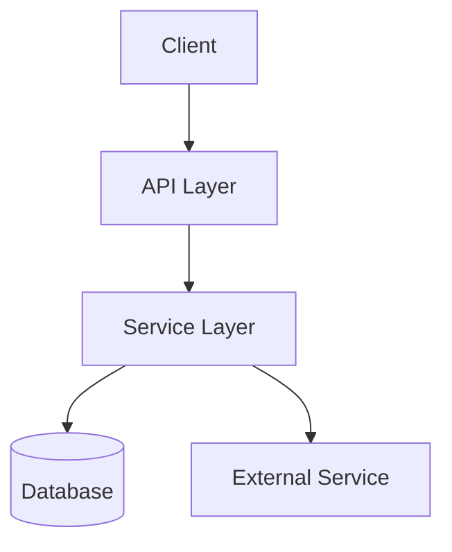
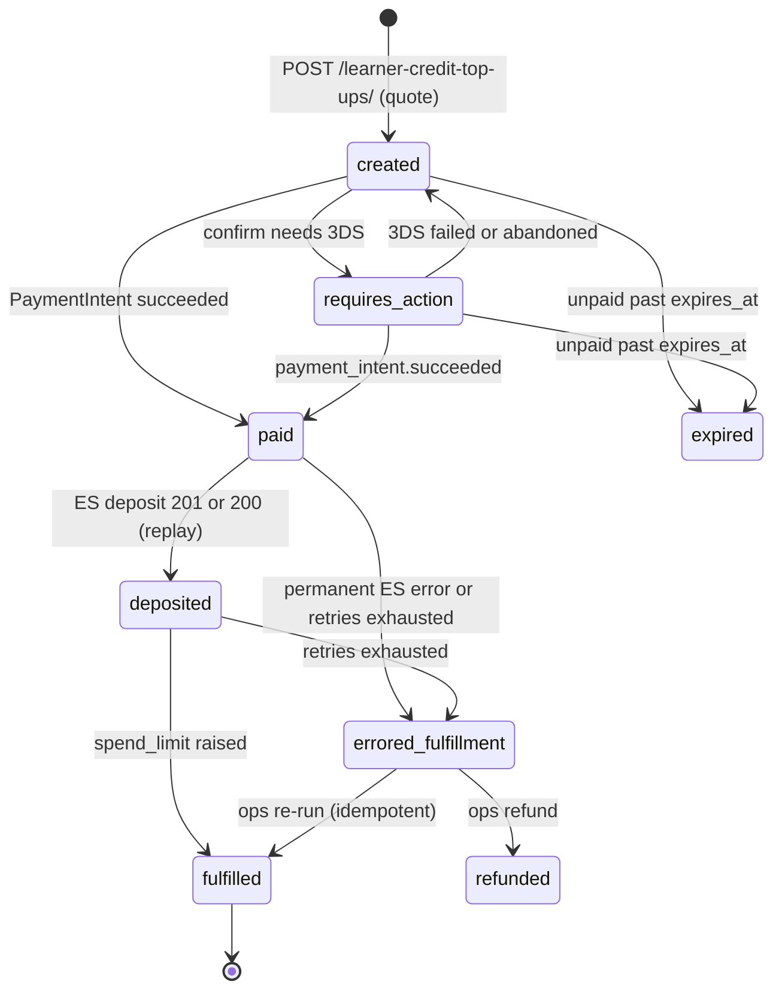
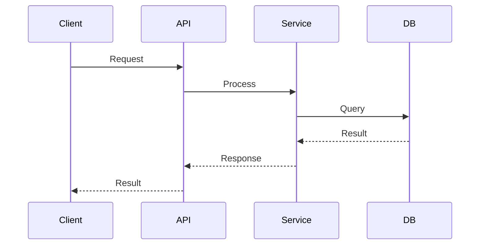

# Tech Spec: Learner Credit Self-Service Top Up

<!-- Ported from Confluence "Tech Spec Template - Agentic SDLC" and reconciled to Inner Loop v7. -->
 
> **Document Classification**
> **Type:** Plan Document (pre-build intent).
> This document captures how we intended to build BEFORE building. It becomes historical after release. Post-build truth lives in ADRs.

> **Conventions used in this spec**
> - **Ground every load-bearing claim about the existing system.** Tag each as **`[Specified]`** — verified against code or the PRD, with a `file:line` citation — or **`[Assumed]`** — not yet verified. An `[Assumed]` claim on a load-bearing path must be promoted to an Open Question (with an owner) before the Ready-to-Build gate; the gate's first criterion is that no load-bearing claim is still `[Assumed]`.
> - **Pre-build decisions live in Key Decisions**, not in ADRs. "Why this vs. that" reasoning belongs here while the design can still churn; ADRs are minted post-build at Knowledge Banking from the decisions that survived the build.

| Field | Value |
| --- | --- |
| Author | rthota-sonata@2u.com (co-authored with Claude) |
| Status | Draft |
| PRD Link | PRD (V2): Learner Credit Top Up — `https://2u-internal.atlassian.net/wiki/spaces/SOL/pages/4004348117/PRD+V2+Learner+Credit+Top+Up` |
| Engineering Lead | rthota-sonata@2u.com |
| Reviewers | TBD |
| Created | 2026-09-24 |
| Last Updated | 2026-09-28 |

## Background & Context

### Problem Summary

Enterprise admins can't add funds to an active Learner Credit budget themselves. Mid-term
top-ups go through Sales or CS, causing multi-day delays, repeat tickets, gaps where learners
can't enroll, and lost revenue. This spec designs a self-service top-up in the admin portal:
pay by card (funds available within 30 seconds) or ACH (3–4 business days), with the original
discount carried forward, eligibility and SDN gates, and an async Salesforce opportunity.
**Top-ups add funds, never time** — the budget's term and expiry don't change.

The PRD frames this as an integration on existing Subscription billing rails. Grounding shows
that is only partly true: signed Stripe webhooks, payment-method management, and email
plumbing exist, but one-time charges, ACH, SDN screening, Salesforce opportunity creation, and
a stored discount rate do not (see Current State). Delivery is therefore split into three
phases — see **Phased Delivery** below.

The two failure modes the design must rule out:

1. **Charged but not credited** — Stripe captures payment, but the deposit or spend-limit
   update fails, or a retry can't tell whether it already succeeded.
2. **Credited but not spendable** — the subsidy ledger grows but the budget's `spend_limit`
   doesn't, so the admin has paid for money they can't use.

### Phased Delivery

**Status:** Approved 2026-09-25 by the Eng Lead and the PM (Alberto Del Toro, in a meeting) —
KD-1, OQ-2.

The PRD's V1 ships in three phases. Card top-ups launch first, with the Salesforce opportunity
included because every deposit must be recorded and tracked auditably from the first sale. ACH
follows once the admin portal's card-only ADR is satisfied; billing history comes last.

| Phase | What ships | Requirements | Must be resolved first |
| --- | --- | --- | --- |
| **1 — Card top-ups + Salesforce** (launch) | "Add Funds" on Budget List and Budget Detail, with eligibility gating · amount selection · pre-charge review and legal agreement · discount carry-forward · card payment (Stripe Elements), saved to the Stripe customer · SDN screening · balance and spend limit raised within 30 s, safe to retry · async Salesforce opportunity · card receipt and payment-failure emails · green confirmation banner · feature flag | R-01 (card), R-02–R-06, R-08 (card), R-09, R-10, **R-11**, R-14, R-16, R-19 · UX-01–UX-03, UX-04 (card) · NFR-01–NFR-05 (NFR-04 without `PendingTopUp`) · S-01–S-04 | OQ-3 (discount and quote source) · OQ-4 (SDN) · OQ-5 (Salesforce route) · OQ-6 (billing-management API on in production) · OQ-7 (credit vs. charge amount) · OQ-8 (standing and agreement-type data) · OQ-9 (enterprise-access's operator access to enterprise-subsidy) |
| **2 — ACH** | Bank payment via Stripe Financial Connections, with the 3–4 business-day notice · "Pending Credits" on Budget List and Budget Detail · ACH-initiated and ACH-cleared emails · amber pending banner · pending state on the success screen · failure email extended to ACH returns | R-01 (ACH), R-06 (pending), R-07, R-08 (bank), R-12, R-17, R-18, R-19 (ACH) · UX-04 (ACH) · NFR-04 (`PendingTopUp`) | Phase 1 live · admin-portal ADR 0012 conditions met: security review and pentest, NACHA audit, Legal review of the authorization wording · a new ADR superseding ADR 0012 |
| **3 — Billing history** | Top-up transactions on the Billing screen (date, description, amount, "Paid") · Billing entry point hidden until the admin's first top-up | R-13 | Phase 1 live · OQ-6 (are the billing-management API and native billing on in production?) |

**Until Phase 2 ships**, admins who want to pay by bank transfer keep going through Sales/CS.

**A Phase 1 decision sets Phase 3's cost.** The existing billing transaction list reads only
Stripe invoices, so charging top-ups through a Stripe Invoice would make them appear there
almost for free, while a direct PaymentIntent would not. KD-3 chose the PaymentIntent, so Phase 3
lists top-up records alongside the invoices.

### Current State — verified against code

*How does the system behave today? What is missing or broken? This section is grounded, not
recalled: every load-bearing claim cites `file:line` in the real repo and is tagged
`[Specified]`. If you cannot cite it, tag it `[Assumed]` and open an Open Question — do not
write it as fact. Grounding happens here, as part of drafting the spec; there is no separate
architecture pass or artifact.*

**Grounded against:**

| Repo | Branch | Commit (short SHA) | At head of main/master? |
| --- | --- | --- | --- |
| edx/enterprise-subsidy | `main` (no `release/ulmo` branch exists) | `78f9af7` | Yes |
| edx/enterprise-access | `main` | `67499592` (re-baselined 2026-09-28 from `994b8d99`; the only change to cited code was 5 lines inserted at line 170 of `customer_billing/models.py`, and the later citations are updated) | Yes — `release/ulmo` (`620ff2fb`) was considered and rejected: it is 282 commits behind `main` (branched 2025-10-30), and admin-portal `master` already calls `main`-only endpoints (`/api/v1/billing-management/*`) |
| edx/frontend-app-admin-portal | `master` (no `release/ulmo` branch exists) | `efb24ed5` (re-baselined 2026-09-28 from `825a8ec1`; browserslist update only, no cited file changed) | Yes |
| edx/frontend-app-enterprise-checkout | `main` (no `release/ulmo` branch exists) | `f3f0217` | Yes |
| openedx/course-discovery (precedent only) | `master` | `97c5ad7` | Yes |
| openedx/openedx-ledger (pip dependency) | tag `2.0.0` — the version pinned at `enterprise-subsidy:requirements/base.txt:231` | `a458d66` | No — `main` (`981831f`) differs only by a PII docstring annotation on `Transaction` |
| 2u-enterprise-subsidy-client (pip dependency of enterprise-access) | `2.2.1`, pinned at `EA:requirements/base.txt:7` | read from the installed package | n/a — pinned version |

*Citations are against read-only snapshots of the refs above, not local working checkouts
(local `enterprise-subsidy` and `frontend-app-admin-portal` are on feature branches).*

Paths below are prefixed by repo: `EA` = enterprise-access, `ES` = enterprise-subsidy,
`LED` = openedx-ledger, `AP` = frontend-app-admin-portal, `CHK` = frontend-app-enterprise-checkout,
`SCL` = 2u-enterprise-subsidy-client.

**Budgets and balance**

- *[Specified]* A budget is a `SubsidyAccessPolicy`; many policies can share one subsidy
  (`subsidy_uuid` is not unique, `EA:enterprise_access/apps/subsidy_access_policy/models.py:218`;
  limits are summed per subsidy at `:359`).
- *[Specified]* Available balance is `min(spend_limit − spent, subsidy ledger balance)`
  (`EA:.../subsidy_access_policy/models.py:587-594`). **A ledger deposit alone does not raise
  it** for any budget that has a `spend_limit`.
- *[Specified]* `clean_spend_limit` rejects active limits summing above the subsidy's total
  deposits (`EA:.../subsidy_access_policy/models.py:434-444`), so the deposit must land
  **before** the spend-limit raise.
- *[Specified]* Ledger balance counts every transaction except `failed`
  (`LED:openedx_ledger/models.py:183-187`), and `create_deposit()` always writes `committed`
  (`LED:openedx_ledger/api.py:303`). A "pending" ACH deposit in the ledger would be spendable
  immediately.
- *[Specified]* No discount rate or quote number is stored anywhere. The subsidy's only
  Salesforce link is `reference_id` (an OpportunityLineItem ID,
  `ES:enterprise_subsidy/apps/subsidy/models.py:162-182`); `grep -i "discount|quote"` over
  enterprise-access models finds nothing relevant. The source of truth is Salesforce (Eng Lead,
  2026-09-25). See OQ-3.
- *[Specified]* The balance an admin sees is fetched fresh from enterprise-subsidy on every
  request. `subsidy_record()` caches only for the length of one request
  (`EA:.../subsidy_access_policy/models.py:510-531`), and `spend_available` reads it through that
  cache (`:558-594`). The one cross-request copy of the subsidy record (TieredCache, `:534-544`) is
  read only by a Braze task (`EA:enterprise_access/apps/content_assignments/tasks.py:226`). The portal
  caches budgets in react-query under `budgets(enterpriseId)`
  (`AP:src/components/EnterpriseSubsidiesContext/data/hooks.js:118-126`;
  `AP:src/components/learner-credit-management/data/constants.js:120`). So for NFR-01, "invalidate
  the balance cache" means invalidating that portal query after a top-up. No server cache needs
  clearing.

**Salesforce and warehouse access today**

- *[Specified]* No service in this design calls Salesforce. Salesforce calls enterprise-access
  (`EA:enterprise_access/apps/api/v1/views/provisioning.py:181`, "Called by Salesforce when the
  paid OLI is created…"). The only outbound Salesforce client in our repos is in
  course-discovery (`simple_salesforce`, `course-discovery:course_discovery/apps/course_metadata/salesforce.py:8`;
  `requirements/base.txt:553`) — a precedent, not reusable code.
- *[Specified]* enterprise-access already has a Snowflake helper using key-pair service
  credentials (`EA:enterprise_access/apps/core/snowflake.py:1, 41`), described as "for
  enterprise-access reporting commands". Its only callers are batch management commands
  (`EA:enterprise_access/apps/core/management/commands/monthly_impact_report.py:8`;
  `EA:enterprise_access/apps/track/management/commands/nudge_dormant_enrolled_enterprise_learners.py:10`);
  nothing in a request path uses it.

**Deposit paths today**

- *[Specified]* `SubsidyAccessPolicy.create_deposit()` — docstring: "referred to as a
  'Top-Up'" (`EA:.../subsidy_access_policy/models.py:1175`) — calls enterprise-subsidy, then
  `spend_limit += qty; save()` (`:1189-1194`). It passes no idempotency key and has no
  compensation if the save fails. Its only caller is the Django admin "Deposit Funds" tool
  (`EA:.../subsidy_access_policy/admin/__init__.py:118`).
- *[Specified]* enterprise-subsidy's only deposit API, `POST /api/v2/subsidies/<uuid>/admin/deposits/`
  (`ES:enterprise_subsidy/apps/api/v2/views/deposit.py:30-97`), requires operator access
  (`ES:enterprise_subsidy/apps/subsidy/rules.py:105`), rejects expired subsidies
  (`deposit.py:86-90`), and requires a sales-contract reference with an existing provider slug
  (`ES:enterprise_subsidy/apps/api/v2/serializers/deposits.py:50-54, 83-92`).
- *[Specified]* `create_deposit()` is not idempotent: a repeated key raises
  (`LED:openedx_ledger/api.py:286-287`) and surfaces as 422. Ledger-lock contention surfaces as
  the same 422 (`LED:openedx_ledger/api.py:317-320`; `deposit.py:96-97`), so callers can't tell
  a retryable failure from a permanent one.
- *[Specified]* The deposit view has a 200-on-replay path that is never used: "only here for when we
  eventually make deposit creation actually idempotent" (`ES:enterprise_subsidy/apps/api/v2/views/deposit.py:58-67, 92-94`).
  The serializer always reports a new deposit (`ES:.../api/v2/serializers/deposits.py:148`).
  enterprise-access's subsidy client already sends `idempotency_key` and documents 429 for lock
  contention (`SCL:edx_enterprise_subsidy_client/client.py:375-397, 406-407`), but
  `SubsidyAccessPolicy.create_deposit()` never passes a key (`EA:.../subsidy_access_policy/models.py:1180-1189`).
- *[Specified]* Deposit `metadata` is unpacked into `create_deposit(**metadata)`
  (`ES:.../api/v2/serializers/deposits.py:125-132`). A key that matches a ledger parameter name,
  such as `subsidy_access_policy_uuid` or `lms_user_id`, is written to that Transaction column
  rather than stored as metadata (`LED:openedx_ledger/api.py:52-65, 274-282`). If a deposit
  carried a policy UUID, it would be summed into that policy's aggregates
  (`ES:enterprise_subsidy/apps/api/paginators.py:30`; `EA:.../subsidy_access_policy/models.py:714-718`)
  and make the policy's spend look smaller than it is.
- *[Specified]* The only reference-provider slug is `salesforce_opportunity_line_item`
  (`ES:enterprise_subsidy/apps/subsidy/migrations/0022_backfill_initial_deposits.py:34-37`).
  Deleting a provider row deletes its deposits (`on_delete=CASCADE`, `LED:openedx_ledger/models.py:746-751`).
- *[Specified]* Only operators can write policies, including `spend_limit`
  (`EA:enterprise_access/apps/core/rules.py:537`). Enterprise admins get learner-level policy
  access (`EA:enterprise_access/settings/base.py:356-366`).

**Stripe and billing (enterprise-access)**

- *[Specified]* The only Stripe checkout is subscription mode, card only
  (`EA:enterprise_access/apps/customer_billing/stripe_api.py:37, 71-73`). No one-time payment
  exists: `grep "PaymentIntent\.create|'mode': 'payment'|Customer\.create\("` → 0 hits.
- *[Specified]* The Stripe customer is found by admin email (`stripe_api.py:83`) and resolved
  per enterprise only through a `CheckoutIntent`
  (`EA:enterprise_access/apps/api/v1/views/customer_billing.py:816-842`). Sales-provisioned
  Learner Credit customers have none, and no code creates one.
- *[Specified]* `CheckoutIntent` models a new-customer purchase — it reserves an enterprise's
  slug/name (`EA:.../customer_billing/models.py:194`) and a license quantity (`:319`) — and
  returns an already-paid intent unchanged (`:795-804`). It does not fit repeated top-ups.
- *[Specified]* The webhook verifies Stripe signatures
  (`EA:enterprise_access/apps/api/authentication.py:58-63`). It handles only `invoice.*` and
  `customer.subscription.*` events and ignores non-subscription invoices
  (`EA:.../customer_billing/stripe_event_handlers.py:379-382`). Processing is inline, and dedup
  is partial (`views/customer_billing.py:203-222`).
- *[Specified]* `payment_intent.succeeded` and `payment_intent.payment_failed` are declared event
  types (`EA:.../customer_billing/stripe_event_types.py:137, 140`) but nothing handles them.
  `persist_stripe_event` records only invoice and subscription events
  (`EA:.../customer_billing/stripe_event_handlers.py:112-123`). The `checkout_intent` foreign
  key is nullable on both event tables (`EA:.../customer_billing/models.py:1071-1073, 1131-1133`).
  No Stripe write call passes an idempotency key (grep `idempotency` over `customer_billing` and
  `provisioning` → 0 hits).
- *[Specified]* No service stores account standing or agreement type (grep
  `account_standing|good_standing|agreement_type` over EA and ES → 0 hits). See OQ-8.
- *[Specified]* The billing-management API (payment methods, address, invoice-based
  transactions) exists (`EA:enterprise_access/apps/api/v1/urls.py:44-45`), and admins have
  access (`EA:.../core/rules.py:635`), but it is off by default
  (`EA:enterprise_access/settings/base.py:678`); production state unknown, see OQ-6. Bank
  accounts can be listed and attached but not created or verified: no Financial Connections
  session, SetupIntent, or mandate code (grep). Transactions come only from `stripe.Invoice.list`
  (`views/customer_billing.py:1748`).
- *[Specified]* Salesforce integration is inbound only (Salesforce calls
  `EA:.../api/v1/views/provisioning.py:181`); Stripe→Salesforce is designed to run through
  Stripe's connector (`EA:docs/decisions/0026-stripe-event-consumption-delivery.rst:26-29`).
  `is_commission_eligible` appears nowhere (grep → 0). See OQ-5.
- *[Specified]* SDN screening has no code; an ADR assumes Stripe handles it
  (`EA:docs/decisions/0030-self-service-purchasing-BFF.rst:488`). Only an embargoed-country
  list exists (`EA:enterprise_access/settings/base.py:706-709`). See OQ-4.
- *[Specified]* enterprise-access sends Segment events through `track_event`
  (`EA:enterprise_access/apps/track/segment.py:14`), which `customer_billing` already uses
  (`EA:.../customer_billing/stripe_event_handlers.py:346`). Portal events are named under
  `edx.ui.enterprise.admin_portal.learner_credit_management` (`AP:src/eventTracking.js:14, 19`); the
  PRD's `top_up_cta_clicked` doesn't follow that convention. Nothing in these repos shows how
  top-up data would reach Snowflake, which K-04 and K-05 are measured from. See OQ-10.
- *[Specified]* Emails are direct Braze sends from Celery tasks with retry
  (`EA:enterprise_access/tasks.py:14-39`). Campaigns are keyed to Teams/Essentials only
  (`EA:.../customer_billing/utils.py:76-80`); no top-up emails exist.
- *[Specified]* Feature flags: one unrelated global waffle flag (`EA:enterprise_access/toggles.py:18`);
  billing gates are Django settings. There is no per-enterprise flag mechanism in enterprise-access.
- *[Specified]* A `CheckoutIntent` owner can PATCH its state from `created` to `paid`
  (`EA:enterprise_access/apps/api/serializers/customer_billing.py:160-179`;
  `EA:.../customer_billing/constants.py:96-100`). Pre-existing and out of scope; raised
  separately with enterprise-access owners. Top-up state must not be client-writable.

**enterprise-subsidy infrastructure**

- *[Specified]* No Celery, no waffle usage, no Stripe code, no balance cache, and deposits
  emit no events (greps; event producers are transaction-only,
  `ES:enterprise_subsidy/apps/core/event_bus.py:46-91`). Balance is computed live
  (`ES:enterprise_subsidy/apps/subsidy/models.py:353-354`), so NFR-01's "invalidate the balance
  cache" has nothing to invalidate in this service.

**Admin portal**

- *[Specified]* A budget's URL id is a policy UUID or an ecommerce offer integer
  (`AP:src/components/learner-credit-management/data/hooks/useBudgetId.js:17-18`); the list
  fetches only active policies (`AP:src/data/services/EnterpriseAccessApiService.ts:278`).
  Offer-based budgets can't take top-ups.
- *[Specified]* Budget cards show available = `spendAvailableUsd` and "pending" =
  `amountAllocatedUsd` (`AP:src/components/EnterpriseSubsidiesContext/data/hooks.js:80-82`).
  "Pending Credits" needs its own field and label.
- *[Specified]* Budget-list items carry no `subsidyUuid` or `spendLimit`
  (`AP:src/components/EnterpriseSubsidiesContext/data/hooks.js:72-88`), and no portal code
  handles a PaymentIntent `client_secret` (grep). Billing calls pass `enterprise_customer_uuid` as
  a query parameter (`AP:src/data/services/EnterpriseAccessApiService.ts:703-826`).
- *[Specified]* "Expiring" status starts at 120 days
  (`AP:src/components/BudgetExpiryAlertAndModal/data/expiryThresholds.js:6`), with a "Contact
  support" CTA; the PRD blocks Add Funds only inside 40 days.
- *[Specified]* Stripe JS is already a dependency (`AP:package.json:47-48`). A Billing page
  exists but shows only when `ENABLE_NATIVE_BILLING` is on and the customer has an active
  subscription (`AP:src/components/billing/data/utils.ts:17-18`), so Learner-Credit-only
  customers never see it.
- *[Specified]* Portal ADR 0012 (Accepted, March 2026) allows cards only; ACH requires
  Financial Connections, a security review and pentest, a NACHA audit, and Legal review
  (`AP:docs/decisions/0012-credit-card-only-payment-methods.rst:51, 81-87`).
- *[Specified]* The checkout MFE is subscription-only and not packaged for reuse, and it runs
  different Paragon/react-query major versions (`CHK:package.json:51, 55` vs
  `AP:package.json:46, 49`). Patterns can be reused; code can't.


### Relevant Architecture

| System | Role in This Feature | Owner |
| --- | --- | --- |
| frontend-app-admin-portal | Add Funds entry points, checkout UI, pending indicator, banners, billing history | Enterprise frontend — TBD |
| enterprise-access | Owns budgets (`SubsidyAccessPolicy.spend_limit`), Stripe billing, webhooks, and Braze emails today | TBD |
| enterprise-subsidy | Ledger of record; deposit write | rthota-sonata@2u.com (Eng Lead) |
| openedx-ledger (pip) | `Deposit` / `Transaction` models, balance, ledger lock | Open edX (shared library) |
| Stripe | Payments, customer, Financial Connections | External |
| Salesforce | Opportunity / revenue attribution | Justin Grabowski (RevOps) |
| Braze | Transactional emails | TBD |
| LMS / edx-enterprise | Enterprise customer record, admin JWT roles, per-enterprise `enterprise_features` | TBD |

## Requirements

*Carried from the PRD (source of truth for what to build), restated here with stable REQ-IDs
so each design decision and the Traceability section can reference them. Tag any requirement
the design assumes but the PRD does not yet state as `[Assumed]` and open an Open Question.*

**REQ-IDs are the PRD's own IDs** (R-, NFR-, UX-), so the spec and the PRD cite the same
numbers. Requirements the PRD states outside its numbered list, or that come from the Eng Lead,
are `S-01` onward. The **Phase** column replaces the template's P0/P1: the PRD doesn't rank
requirements, and delivery order comes from the approved phases (KD-1). A requirement that spans
two phases shows both. R-15 is not a requirement; the PRD uses that ID only for an out-of-scope
item (OQ-1).

| REQ-ID | Requirement | Type | Phase | Source |
| --- | --- | --- | --- | --- |
| R-01 | Add funds to an existing budget by card or by ACH. The balance updates within 30 s of a successful card charge, or within 30 s of ACH settlement. | Functional | 1 (card) · 2 (ACH) | PRD R-01 |
| R-02 | Choose a preset ($500, $1,000, $2,500, $5,000) or a custom amount from $500 to $20,000, validated on both client and server. The order summary updates live. | Functional | 1 | PRD R-02 |
| R-03 | Billing Details shows a pre-charge review: amount, discount, total, current and new balance, payment method, budget expiry. Pay stays disabled until the legal checkbox is checked. | Functional | 1 | PRD R-03 |
| R-04 | The admin accepts the Top-Up Legal Agreement, which shows the original Salesforce quote number and the budget expiry, and states that the original order terms apply. | Functional | 1 | PRD R-04 |
| R-05 | The original sale's discount carries forward automatically. The system uses the client's stored rate (which can be 0) and never derives a new one. Admins can't edit it; with no discount on record, the discount row is hidden. | Functional | 1 | PRD R-05 |
| R-06 | An order summary shows on every step. The success screen adds the transaction ID and payment method. A pending ACH top-up shows the credit as "Pending". | Functional | 1 · 2 (pending) | PRD R-06 |
| R-07 | Pay by bank through Stripe Financial Connections (search, sign in, select, link), with a 3–4 business-day settlement notice. | Functional | 2 | PRD R-07 |
| R-08 | Cards (Stripe Elements) and linked bank accounts are saved to the shared Stripe customer and pre-selected next time. Raw card data never touches edX servers. | Functional | 1 (card) · 2 (bank) | PRD R-08 |
| R-09 | Ineligible budgets can't be topped up. The portal disables Add Funds with a warning when fewer than 40 days remain; the backend separately checks account standing, agreement type, and active status, and returns 403 with structured error codes. | Functional | 1 | PRD R-09 |
| R-10 | SDN screening runs on the backend for every transaction and every new or changed payment method. | Functional | 1 | PRD R-10 |
| R-11 | The balance updates within 30 s of a successful charge. An async Salesforce opportunity is created with `is_commission_eligible: false` and never blocks the success screen. | Functional | 1 | PRD R-11 |
| R-12 | In-flight ACH shows "Pending Credits" (amount and initiation date) on Budget Detail and Budget List. It is informational only and clears on settlement or failure. | Functional | 2 | PRD R-12 |
| R-13 | Top-ups appear on the Billing screen (date, description, amount, "Paid"). The Billing entry point stays hidden until the admin's first top-up. | Functional | 3 | PRD R-13 |
| R-14 | Checkout is scoped to the selected budget's `subsidy_uuid`; no cross-budget selection. | Functional | 1 | PRD R-14 |
| R-16 | A successful card charge sends a receipt email saying the credits are available now. | Functional | 1 | PRD R-16 |
| R-17 | An initiated ACH payment sends an email: payment in progress, credits pending, funds in 3–4 business days. | Functional | 2 | PRD R-17 |
| R-18 | A cleared ACH payment sends an email: credits applied and available. | Functional | 2 | PRD R-18 |
| R-19 | A failed or declined payment sends an email with corrective guidance. A declined card also shows an inline error. | Functional | 1 (card) · 2 (ACH return) | PRD R-19 |
| NFR-01 | Performance: the balance updates within 30 s of a card charge; the top-up endpoint responds in under 500 ms, excluding Stripe latency; writes invalidate the balance cache. | NFR | 1 | PRD NFR-01 |
| NFR-02 | Security: PCI-DSS (no raw card data on edX servers), SDN screening per transaction, RBAC via JWT (`SYSTEM_ENTERPRISE_ADMIN_ROLE`), idempotency keys against double charges, and a security review before release. | NFR | 1 | PRD NFR-02 |
| NFR-03 | Accessibility, WCAG 2.1 AA: full keyboard navigation, screen-reader tested, contrast of at least 4.5:1, status changes announced, color never the only signal. Paragon components only. | NFR | 1 | PRD NFR-03 |
| NFR-04 | Scalability: balance writes are atomic and race-free under concurrent load; a `PendingTopUp` model tracks in-flight ACH and soft-deletes after 30 days; Celery absorbs Salesforce-event backpressure. | NFR | 1 · 2 (`PendingTopUp`) | PRD NFR-04 |
| NFR-05 | Compatibility: Chrome, Firefox, Safari, Edge (latest 2 versions); responsive down to 375 px; behind `FEATURE_LEARNER_CREDIT_TOP_UP`, and with the flag off all entry points are hidden and requests return 404. | NFR | 1 | PRD NFR-05 |
| UX-01 | Checkout is an in-portal, full-content-area flow (not a modal) with a breadcrumb and a 3-step stepper: Select Amount → Billing Details → Confirmation. A live order-summary sidebar shows on the first two steps. | Functional (UX) | 1 | PRD UX-01 |
| UX-02 | Add Funds appears on Budget List and Budget Detail. For an ineligible budget it is disabled, with an inline warning explaining why. | Functional (UX) | 1 | PRD UX-02 |
| UX-03 | Failures show inline: a declined card gets an alert to retry or switch payment method; an ineligible budget gets a warning banner. | Functional (UX) | 1 | PRD UX-03 |
| UX-04 | After checkout, Budget Detail shows a banner: green ("funds added — now available") for a card, amber ("top-up pending") for ACH. | Functional (UX) | 1 (card) · 2 (ACH) | PRD UX-04 |
| S-01 | Every self-service deposit is recorded and auditable in the database: who started it, the amount, when, the payment method and reference, and the discount applied. | Functional | 1 | Eng Lead, 2026-09-25; the repo PRD's Outcome 2 (`ES:docs/prd/learner-credit-top-up-prd.md:76`). Not in the PRD V2 text. |
| S-02 | A top-up adds funds, never time. It never changes the budget's or the subsidy's term or expiration, and it is not a renewal. | Functional (constraint) | 1 | PRD Executive Summary ("Core constraint") and Out of Scope |
| S-03 | Emit the tracking events the success metrics are measured from: at least the K-01 funnel (Add Funds clicked → payment succeeded), plus whatever K-04 and K-05 need to reach Snowflake (OQ-10). | Functional | 1 | PRD Success Metrics |
| S-04 | Make the guardrails measurable: the failed-payment rate (must stay below 5%) and the SDN failure rate (no upward anomaly). The third guardrail, CS/Sales ticket volume, is measured outside these systems. | NFR | 1 | PRD Success Metrics, Guardrails |

**Where the design reads the PRD differently** (each is settled or tracked elsewhere in this spec):

- NFR-01, "invalidate the balance cache": no server cache sits on the balance path. The portal's
  budgets query is what gets invalidated (Current State).
- NFR-01, "under 500 ms": `pay` funds the budget in the same request (KD-3), and that includes a
  call to enterprise-subsidy that waits on the ledger lock. This is settled in the Performance Budget.
- NFR-04, `PendingTopUp`: replaced by `LearnerCreditTopUp` in `state=processing`. Rows are kept,
  not soft-deleted after 30 days, because of S-01 (Data Model). To be confirmed with the PM in Phase 2
  design.
- R-09 and R-10 depend on data or checks that don't exist yet (OQ-8, OQ-4).

## Key Decisions

*Pre-build decisions and the reasoning behind them ("why this vs. that") — the
architecture-justification / tradeoff record. These are decisions **of this spec**, provisional
until built. Each is grounded in the Current State above and cites the REQ(s) it serves. After
release, the decisions that survived the build are minted as ADRs at Knowledge Banking; the
`Rejected Alternative` column is the fuller Alternatives Considered table's short form.*

| # | Decision | Why (tradeoff / justification) | Rejected Alternative | REQs |
| --- | --- | --- | --- | --- |
| KD-1 | Deliver in three phases (see Phased Delivery): (1) card top-ups plus the Salesforce opportunity, (2) ACH and Pending Credits, (3) billing history. | ACH is blocked by admin-portal ADR 0012 until a security review, pentest, NACHA audit, and Legal review are done, and one-time charges are net-new; shipping card first delivers the value without waiting on ACH compliance. Salesforce is in Phase 1 because deposits must be recorded and tracked auditably in the database from the first sale (Eng Lead, 2026-09-25); it also protects revenue attribution (PRD RK-03, K-03), and Phase 1 already needs Salesforce data for the discount (OQ-3). Billing history waits on OQ-6 and on how Phase 1 charges. | One V1 release with every PRD requirement (all value blocked on ACH compliance); Salesforce opportunity in a later phase (revenue from early top-ups unattributed). | All — per-phase mapping in Phased Delivery |
| KD-2 | Top-ups live in enterprise-access's `customer_billing` app. A new `LearnerCreditTopUp` model owns the state machine and the orchestration. enterprise-subsidy stays the ledger of record and only takes the deposit. | enterprise-access already has the Stripe client, the webhook registry (`EA:.../stripe_event_handlers.py:524-554`), billing-management access control, the Celery and Braze tasks, and write access to `spend_limit`. enterprise-subsidy has none of these (Current State). `customer_billing` rather than a new app because the top-up needs that app's webhook dispatch, Stripe helpers and permissions anyway; a new app would only be separate in name. | Record in enterprise-subsidy (it would need Stripe, Celery, a webhook, and a call back into enterprise-access to raise `spend_limit`); a separate `top_up` app in enterprise-access (it would import all of `customer_billing` anyway). | R-01, R-09, R-11, R-14, NFR-04; S-01 |
| KD-3 | Charge each top-up through one Stripe PaymentIntent, created and confirmed on the server with a saved card. Fulfill in the same request when the charge succeeds; the `payment_intent.succeeded` webhook and a Celery task are backstops. | Confirming on the server puts the eligibility and SDN checks at the moment of charge (R-09, R-10). Fulfilling in the same request meets the 30-second target (R-01, NFR-01) without waiting for webhook delivery. With one PaymentIntent per top-up, a double charge can't happen (NFR-02, RK-04). The live invoice handlers, which only handle subscriptions (`EA:.../stripe_event_handlers.py:353-383, 560`), are left alone. Cost: Phase 3 billing history must list top-up records alongside Stripe invoices, because today it reads only invoices (`EA:.../views/customer_billing.py:1748`). | Confirm in the browser and fulfill only from the webhook (no server check at the moment of charge, and funds wait for webhook delivery); one-off Stripe Invoice (Phase 3 nearly free, but it changes the live subscription invoice path and needs more Stripe calls per charge). | R-01, R-06, R-08, R-10, R-13 (cost), R-16, R-19, NFR-01, NFR-02 |
| KD-4 | Add a new `EnterpriseStripeCustomer` table that maps each enterprise to its Stripe customer, backfilled from `CheckoutIntent`. For an enterprise with no Stripe customer, enterprise-access creates one when the first quote is made. | Sales-provisioned Learner Credit customers have no `CheckoutIntent`, so today neither top-ups nor saved payment methods can find their Stripe customer (`EA:.../views/customer_billing.py:816-842`). One table fixes both. | Stripe customer search by metadata (the search index lags and is rate-limited, so duplicate customers are possible); a synthetic `CheckoutIntent` (it reserves a slug and name, and needs a product and a license quantity). | R-08, R-14 |
| KD-5 | Make enterprise-subsidy's existing deposit endpoint safe to retry when the caller sends an explicit `idempotency_key`: 200 for a replay, 409 for a conflict, 429 when the ledger is locked. Add a `stripe_payment_intent` reference provider for top-up deposits. | Today a retry and a lock timeout both return 422 (`ES:.../api/v2/views/deposit.py:96-97`), so enterprise-access can't tell "already done" from "try again" from "failed". The view already has the 200-on-replay path (`deposit.py:58-67, 92-94`) and the enterprise-access client already sends keys (`SCL:.../client.py:375-407`), so the change is small and needs no client release. Calls without a key still get 422, so an operator's accidental duplicate is still blocked. A top-up has no OpportunityLineItem when the deposit is made, so its reference is the PaymentIntent. | A new endpoint just for self-service deposits (duplicates the validation and needs a new client method); no enterprise-subsidy change, with enterprise-access checking for an existing deposit first (no deposit lookup exists, `ES:enterprise_subsidy/apps/api/filters.py:41-48`, and the check races). | R-01, NFR-02, NFR-04; S-01 |

*If this spec supersedes an earlier (e.g. ungrounded) draft, add a **Superseded Decisions**
table here dispositioning each prior decision (Reversed / Replaced / Carried / Reshaped) with
what grounding found — so the reasoning survives the rewrite.*

## Proposed Design

### High-Level Architecture



### Data Model

*The shape follows KD-2 through KD-5. Column-level detail (indexes, the ERD) is finalized in the
impl-plan.*

**New Models / Tables**

| Model / Table | Fields | Relationships | Notes |
| --- | --- | --- | --- |
| `LearnerCreditTopUp` (EA `customer_billing`) | See the field table below | FK → `SubsidyAccessPolicy` (PROTECT); FK → `User` (SET_NULL) | One row per top-up, from quote to fulfillment. This is the audit record for every self-service deposit (S-01), and rows are never deleted. `TimeStampedModel` + `HistoricalRecords` with a UUID primary key, like `ForcedPolicyRedemption` (`EA:.../subsidy_access_policy/models.py:2152-2229`). State changes go through an allowed-transitions table, as `CheckoutIntent` does (`EA:.../customer_billing/constants.py:96-121`; `models.py:371-396`). |
| `EnterpriseStripeCustomer` (EA `customer_billing`) | `enterprise_customer_uuid` (UUID, unique) · `stripe_customer_id` (char 255, unique) · `source` (`checkout_intent_backfill` / `created_for_top_up`) | None; the enterprise is referenced by UUID, as elsewhere in EA | KD-4. `TimeStampedModel` + `HistoricalRecords`. `_get_stripe_customer_id_for_enterprise` reads this table first and falls back to `CheckoutIntent` (`EA:.../views/customer_billing.py:816-842`). |
| enterprise-subsidy: no new table | — | — | One new data row: a `SalesContractReferenceProvider` with slug `stripe_payment_intent` (KD-5; slugs are limited to 32 characters, `LED:openedx_ledger/models.py:683-685`). Each top-up is an ordinary ledger `Deposit` + `Transaction` (`LED:openedx_ledger/models.py:701-756`), so top-up funds are interchangeable with the original funds (PRD A-3). |

**`LearnerCreditTopUp` fields**

| Field | Type | Notes |
| --- | --- | --- |
| `uuid` | UUID, PK | Source of every idempotency key: `lc-top-up-<uuid>` for the Stripe PaymentIntent and for the ES deposit. Shown to the admin as the transaction ID (R-06). |
| `enterprise_customer_uuid` | UUID, indexed | Must match the policy's enterprise; checked on every request. |
| `subsidy_access_policy` | FK, PROTECT | The budget (R-14). PROTECT because a paid top-up must never lose its budget. Policies are soft-deleted with `active=False`, so they are never hard-deleted in normal use (`EA:.../subsidy_access_policy/models.py:1196-1206`). |
| `subsidy_uuid` | UUID, indexed | Copy of `policy.subsidy_uuid` taken when the top-up is created; this is where the deposit goes. |
| `initiated_by` / `initiated_by_lms_user_id` | FK `User` (SET_NULL) / integer | The integer ID is kept after the user is retired (`EA:enterprise_access/apps/core/models.py:20`). Needs a `.. pii:` annotation, as on `StripeEventData` (`EA:.../customer_billing/models.py:1050`). |
| `state` | char, indexed, choices | See the state machine below. Only the server writes it; clients can never set it (see the `CheckoutIntent` PATCH gap in Current State). |
| `amount_cents` | BigInteger | Credit added to the budget. It is used three times: as the ES `desired_deposit_quantity`, as the `spend_limit` increase, and as the amount validated against the 50,000–2,000,000 range (R-02). |
| `discount_rate` | Decimal(5,4), null | Copied at quote time (R-05). `NULL` means no discount is on record, so the discount row is hidden. `0` is a real 0% rate and is never used as a default for `NULL` (RK-05). Source: OQ-3. |
| `discount_cents` / `charge_amount_cents` | BigInteger | The card is charged `amount_cents − discount_cents`. `[Assumed]` The admin pays the discounted price and receives the full credit amount. See OQ-7. |
| `currency` | char(3) | `usd` only. |
| `sales_quote_number` | char, null | Copied at quote time for the legal agreement (R-04). Source: OQ-3. |
| `agreement_version` / `agreement_accepted_at` | char / datetime, null | Set when the admin pays (R-04). |
| `stripe_customer_id` | char, indexed | Taken from `EnterpriseStripeCustomer`. |
| `stripe_payment_intent_id` | char, unique, null | Each top-up has exactly one PaymentIntent (KD-3). |
| `payment_method_type` / `stripe_payment_method_id` | char / char, null | `card` in Phase 1; `us_bank_account` in Phase 2. Card brand and last 4 digits are fetched from Stripe, not stored. |
| `deposit_uuid` / `ledger_transaction_uuid` | UUID, null | Returned by ES (`ES:enterprise_subsidy/apps/api/v2/serializers/deposits.py:30-37`). |
| `spend_limit_before` / `spend_limit_after` | Integer, null | Written in the same DB transaction as the `spend_limit` increase. They are the audit trail and show the increase happened once. They stay `NULL` when the policy has no `spend_limit`, because in that case the ledger deposit alone raises the available balance (`EA:.../subsidy_access_policy/models.py:587-594`). |
| `expires_at` | datetime | Unpaid quotes expire (proposed: 30 minutes), so a stale discount or balance is never charged. |
| `paid_at` / `deposited_at` / `fulfilled_at` | datetime, null | |
| `last_error` | text, null | Same role as `CheckoutIntent.last_checkout_error` (`EA:.../customer_billing/models.py:326`). |
| `salesforce_opportunity_id` / `salesforce_synced_at` | char / datetime, null | For R-11. The shape may change once OQ-5 is answered. |

Constraints: `stripe_payment_intent_id` is unique, and `(subsidy_access_policy, state)` is indexed for the
Pending Credits and billing-history queries.

**`LearnerCreditTopUp` states**



A declined card leaves the top-up in `created`, because the PaymentIntent returns to
`requires_payment_method`, so the admin can retry or switch cards. Phase 2 adds two states:
`processing` for ACH in flight and `payment_failed` for an ACH return. Pending Credits is then just
`state=processing`, which replaces the separate `PendingTopUp` model named in PRD NFR-04. Pending
rows are kept, not soft-deleted after 30 days, because every deposit must stay auditable. Confirm
this during Phase 2 design.

**Fulfillment rules.** These rules either rule out the two failure modes in the Problem Summary or make them trigger an alert.

1. The deposit is made only after the PaymentIntent has succeeded (PRD Principle 2).
2. **Deposit step:** the ES call uses the key `lc-top-up-<uuid>`. A replay returns the same deposit (KD-5), so retries never deposit twice.
3. **Spend-limit step:** one `transaction.atomic()` block locks the policy and the top-up with
   `select_for_update()`, adds `amount_cents` to `spend_limit`, and moves the top-up to `fulfilled`.
   It runs only from `deposited`, so it runs once. It must read a fresh `total_deposits`, because
   `clean_spend_limit` reads the subsidy record from the request cache
   (`EA:.../subsidy_access_policy/models.py:434-444, 511-545`). `select_for_update` is not used
   anywhere in enterprise-access today (grep → 0 hits), so this is a new pattern for the repo.
4. A top-up that stays in `paid` or `deposited` past the alert threshold, or reaches
   `errored_fulfillment`, pages on-call. This is the "charged but not credited" alarm; the
   threshold is set in Monitoring & Alerting.
5. Deposit metadata uses only keys that don't clash with ledger parameter names. It never uses
   `subsidy_access_policy_uuid` or `lms_user_id` (see Current State). The metadata written is:
   `source: "learner_credit_top_up"`, `learner_credit_top_up_uuid`, `top_up_policy_uuid`,
   `initiated_by_lms_user_id`, `stripe_payment_intent_id`, `discount_rate`, `charge_amount_cents`.
   The deposit's provider is `stripe_payment_intent` and its reference ID is the `pi_…` ID. Together
   these let the ledger alone show who made the top-up, how much, when, which payment, and what
   discount applied (S-01).

**Migrations Required**

| Migration | Description | Risk (table size, locks) | Rollback Strategy |
| --- | --- | --- | --- |
| EA `customer_billing`: add `LearnerCreditTopUp` and its history table | New tables | None; creates tables only and locks no existing table | Reverse the migration only before the first real top-up. After launch, turn the flag off and keep the tables, which hold payment records. |
| EA `customer_billing`: add `EnterpriseStripeCustomer` and its history table | New tables | None | Same as above. |
| EA `customer_billing`: backfill `EnterpriseStripeCustomer` from `CheckoutIntent` | For each enterprise, take the latest intent that has a Stripe customer ID, using the same ordering as `EA:.../views/customer_billing.py:816-842` | Low. Reads `CheckoutIntent`, which has about one row per self-service purchase (`[Assumed]` small). `get_or_create` makes it safe to re-run. | The reverse step does nothing. The lookup falls back to `CheckoutIntent`, so the code can be rolled back on its own. |
| ES `subsidy`: data migration that adds the provider `stripe_payment_intent` | `get_or_create`, like `ES:.../subsidy/migrations/0022_backfill_initial_deposits.py:34-37` | None; adds one row | **The reverse step must do nothing.** Deleting the provider row would also delete every top-up `Deposit` (`LED:openedx_ledger/models.py:746-751`). |

Deploy order: the ES migration and deposit fix first, then the EA migrations, then the EA code behind the flag, then the portal.

*ERD: Generate during Technical Readiness (Step 4): `Generate ERD from the data model section of this tech-spec`*

### API Contracts

*All new endpoints are in enterprise-access under `/api/v1/learner-credit-top-ups/` (KD-2).
Conventions match billing-management:*

- *Auth is JWT.*
- *`enterprise_customer_uuid` is a required query parameter on every call and is the access-control
  context (`EA:.../views/customer_billing.py:958-961`).*
- *JSON is snake_case, and the portal converts it to camelCase (`AP:src/data/services/EnterpriseAccessApiService.ts:703-826`).*
- *Money is in integer USD cents.*

*Permission: a new `customer_billing.learner_credit_top_up` permission, granted to the same roles as
`BILLING_MANAGEMENT_ACCESS_PERMISSION`: customer-billing operators and admins. Enterprise admins
get the admin role through `SYSTEM_ENTERPRISE_ADMIN_ROLE` (`EA:.../core/rules.py:634-637`;
`settings/base.py:356-363`). A separate permission lets top-up access be narrowed later (PRD open
question 3) without changing billing-management access. Every endpoint returns 404 when the feature
flag is off (NFR-05); the flag mechanism is set in Feature Flags.*

**New Endpoints**

| Method | Path | Request Body | Response | Auth | Notes |
| --- | --- | --- | --- | --- | --- |
| GET | `/api/v1/learner-credit-top-ups/eligibility/?enterprise_customer_uuid=&policy_uuid=` | — | 200 `{"results": [{"policy_uuid", "is_eligible", "reasons": [{"error_code", "developer_message"}], "subsidy_expiration_datetime"}]}`. Covers every active policy of the enterprise, or only the one named by `policy_uuid`. | top-up permission | Drives the Add Funds button on Budget List and Budget Detail (UX-02, R-09). It runs the same checks as the write endpoints, so the portal and backend can't disagree (RK-07). It is not added to the shared `subsidy-access-policies` serializer, because that would add a subsidy call to every policy list. |
| POST | `/api/v1/learner-credit-top-ups/?enterprise_customer_uuid=` | `{"subsidy_access_policy_uuid", "amount_cents"}` | 201 top-up (see below) with `state: created` | same | Creates the quote. It checks eligibility, records the discount, quote number and balances, and makes sure the enterprise has a Stripe customer (KD-4). The result feeds the Billing Details review (R-03) and the legal agreement (R-04). Nothing is charged. To change the amount, create a new quote; unpaid quotes expire. |
| POST | `/api/v1/learner-credit-top-ups/<uuid>/pay/?enterprise_customer_uuid=` | `{"payment_method_id": "pm_…", "payment_attempt_id": "<uuid>", "agreement_accepted": true, "agreement_version"}` | 200 top-up. `state` is `fulfilled`, or `paid` (fulfillment deferred; poll), or `requires_action` with a `client_secret` (3DS). 402 if the card is declined. | same | See KD-3. Details below the table. |
| GET | `/api/v1/learner-credit-top-ups/<uuid>/?enterprise_customer_uuid=` | — | 200 top-up | same | Used by the success screen, and for polling after 3DS or a deferred fulfillment (R-06). |
| GET | `/api/v1/learner-credit-top-ups/?enterprise_customer_uuid=&subsidy_access_policy_uuid=&state=` | — | 200 paginated list of top-ups | same | Ships in Phase 1 for ops and the success screen. Phase 2 reads `state=processing` for Pending Credits (R-12). Phase 3 reads `state=fulfilled` for billing history and for the "at least one top-up" check (R-13). |

**How `pay` works** (all steps on the server):

1. It re-checks eligibility and SDN screening (OQ-4).
2. It creates the top-up's single PaymentIntent with idempotency key `lc-top-up-<uuid>`. Setting
   `setup_future_usage` saves the card to the Stripe customer (R-08).
3. It confirms the PaymentIntent with key `lc-top-up-<uuid>-confirm-<payment_attempt_id>`. The
   portal generates one `payment_attempt_id` per click of Pay, so a double-click replays the same
   request instead of charging again. A PaymentIntent can succeed only once, so no sequence of
   retries can charge twice (NFR-02, RK-04).
4. On success, it tries fulfillment in the same request. If that fails for any reason, a Celery task
   takes over.

**Top-up response body**

```json
{
  "uuid": "6f1c…",
  "state": "fulfilled",
  "subsidy_access_policy_uuid": "…",
  "amount_cents": 100000,
  "discount_rate": "0.1000",
  "discount_cents": 10000,
  "charge_amount_cents": 90000,
  "currency": "usd",
  "current_balance_cents": 25000,
  "new_balance_cents": 125000,
  "subsidy_expiration_datetime": "2027-06-30T00:00:00Z",
  "sales_quote_number": "Q-01234",
  "agreement_version": "2026-10-01",
  "payment_method": {"type": "card", "brand": "visa", "last4": "4242"},
  "client_secret": null,
  "expires_at": "…",
  "created": "…",
  "fulfilled_at": "…"
}
```

- `discount_rate` and `discount_cents` are `null` when there is no discount (R-05).
- `client_secret` is set only in `requires_action`.
- The balances are computed from `spend_available` at quote time (`EA:.../subsidy_access_policy/models.py:573-594`).
- Stripe IDs other than the `client_secret` are not exposed.

**Modified Endpoints**

| Method | Path | Change | Breaking? | Migration Path |
| --- | --- | --- | --- | --- |
| POST | ES `/api/v2/subsidies/<uuid>/admin/deposits/` | KD-5; details below the table. | No, for known callers. The only caller is enterprise-access's Deposit Funds tool, and it sends no key and no metadata (`EA:.../subsidy_access_policy/admin/views.py:143-147`). | Ship before the enterprise-access changes. The client already sends `idempotency_key` and documents 429 (`SCL:.../client.py:375-407`), so no client release is needed. |
| GET, POST, DELETE | EA `/api/v1/billing-management/payment-methods/…` and the other actions that use the same lookup | `_get_stripe_customer_id_for_enterprise` reads `EnterpriseStripeCustomer` first and falls back to `CheckoutIntent` (KD-4). Learner-Credit-only customers now get their saved cards instead of a 404 "Stripe customer not found". | No; additive. Subscription customers resolve to the same Stripe customer because of the backfill. | Run the backfill migration before deploying the code. Listing saved cards so they can be pre-selected (R-08) needs `ENABLE_BILLING_MANAGEMENT_API` on in production, so OQ-6 now blocks Phase 1 too. |
| POST | EA `/api/v1/customer-billing/stripe-webhook` | Handles two new event types; details below the table. | No; new event types only. | The Stripe webhook endpoint must be subscribed to `payment_intent.*` events (ops configuration). |

**Deposit endpoint changes** (ES):

- These apply only when the caller sends an explicit `idempotency_key`. If a deposit with that key
  already exists with the same quantity, reference ID and provider, the endpoint returns 200 with
  that deposit. This uses the unused path at `deposit.py:58-67, 92-94`.
- The same key with different values returns 409 `deposit_idempotency_conflict`.
- Lock contention returns 429 `ledger_lock_error`. The ledger library wraps the lock error in its
  own exception, so the view checks the wrapped cause (`LED:openedx_ledger/api.py:317-320`), as the
  v2 transaction view does (`ES:.../api/v2/views/transaction.py:192-196`).
- If two requests with the same key race, the one that loses re-reads the deposit and returns 200.
- `metadata` keys that match ledger parameter names return 400.
- Calls without a key are unchanged: a duplicate still gets 422.

**Webhook changes** (EA):

- New handlers registered with `@on_stripe_event` (`EA:.../stripe_event_handlers.py:524-554`):
  `payment_intent.succeeded` queues fulfillment, and `payment_intent.payment_failed` sends the
  failure email (R-19). Phase 2 adds `payment_intent.processing`.
- The handlers ignore any PaymentIntent without `metadata.learner_credit_top_up_uuid`, because
  subscription invoices also create PaymentIntents. This mirrors the existing invoice filter (`:353-383`).
- `persist_stripe_event` gets a new branch that stores these events with `checkout_intent=NULL`
  (both foreign keys are nullable). A redelivered event does no harm, because fulfillment checks the
  top-up's state before acting.

**API Error Codes**

The error body is `{"error_code": "…", "developer_message": "…"}`. This is the structured format customer
billing already uses (`EA:.../api/serializers/customer_billing.py:87-98`; codes defined as in
`customer_billing/constants.py:6-60`). Access-control 403s and 404s keep DRF's `{"detail": …}` body. The portal
doesn't handle `error_code` anywhere yet. The closest existing pattern is the assignment flow, which
branches on a `reason` field
(`AP:src/components/learner-credit-management/assignment-modal/CreateAllocationErrorAlertModals.jsx:59-62`).

| Code | Condition | Client Action |
| --- | --- | --- |
| 400 `invalid_amount` | `amount_cents` is outside 50,000–2,000,000 | Show inline validation; the portal also checks this itself (R-02). |
| 400 `agreement_not_accepted` | `agreement_accepted` is not true, or `agreement_version` is not the current version | Keep Pay disabled (R-03) and reload the agreement. |
| 402 `payment_declined` (with `decline_code`) | Stripe declined the card. The top-up stays in `created`. | Show the inline decline alert and offer retry or switch card (UX-03). The webhook sends the failure email (R-19). |
| 403 (DRF `detail`) | The caller is not an admin of this enterprise | Show the generic no-access page. |
| 403 `budget_not_active` | The policy is inactive or retired, or the subsidy is not active | Disable Add Funds and show the warning (UX-02). |
| 403 `budget_expiring_soon` | Fewer than 40 days until `subsidy_expiration_datetime` | Disable Add Funds and show the "fewer than 40 days" warning. |
| 403 `account_not_eligible` | Account standing or agreement type fails (R-09). No data source exists today; see OQ-8. | Disable Add Funds and point to support. |
| 403 `payment_screening_failed` | SDN screening failed (R-10, OQ-4) | Show a generic "we can't process this payment, contact support" message. Never mention the screening. |
| 404 (DRF `detail`) | The flag is off (NFR-05), or the top-up or policy doesn't exist or belongs to another enterprise | Hide the entry points. |
| 409 `top_up_not_payable` | Pay was called on a top-up that is not in `created` | Fetch the top-up and show its current state. |
| 409 `top_up_expired` | The quote is past `expires_at` | Restart at Select Amount, which creates a new quote. |
| 422 `pricing_unavailable` | The discount or quote record is missing or misconfigured (RK-05) | Block checkout and point to support. |
| 503 `pricing_source_unavailable` | The pricing source (OQ-3) is unreachable | Retry later. |
| 503 `payment_provider_unavailable` | A Stripe error other than a decline | Retry later. Retrying the same top-up is safe. |
| ES: 200 (replay), 409 `deposit_idempotency_conflict`, 429 `ledger_lock_error`, 422 `deposit_on_expired_subsidy` | Internal calls from enterprise-access to enterprise-subsidy only | 200: continue. 429: the Celery task retries with backoff (`EA:enterprise_access/tasks.py:14-39`). 409 or 422: move to `errored_fulfillment`, which pages on-call and starts the refund runbook. |

### Sequence Diagrams



### Integration Points

| External System | Protocol (REST / gRPC / Event) | Contract | Failure Mode (Timeout / 5xx / Queue full) | Fallback |
| --- | --- | --- | --- | --- |
| | | | | |

### Event / Message Contracts

| Event Name | Producer | Consumer(s) | Schema | Ordering Guarantee |
| --- | --- | --- | --- | --- |
| | | | | |

## Non-Functional Design

### Performance Budget

| Metric | Target | Measurement | Current Baseline |
| --- | --- | --- | --- |
| Response time p50 | | | |
| Response time p99 | | | |
| Throughput | | | |
| DB query time | | | |

### Scalability Considerations

*How does this behave at 10x load? What breaks first?*

### Security Design

| Concern | Approach | Validation |
| --- | --- | --- |
| Authentication | | |
| Authorization | | |
| Data at rest | | |
| Data in transit | | |
| Input validation | | |
| PII handling | | |

### Accessibility Impact

*New UI? Reference Paragon components and WCAG requirements from PRD.*

## Alternatives Considered

| # | Alternative | Pros | Cons | Why Not Chosen |
| --- | --- | --- | --- | --- |
| 1 | | | | |

*This is the fuller companion to Key Decisions above (each KD's rejected alternative expands
here). After release, the chosen approach and its alternatives are minted as an ADR.*

## Risks & Open Questions

### Technical Risks

| # | Risk | Likelihood | Impact | Mitigation |
| --- | --- | --- | --- | --- |
| 1 | | | | |

### Open Questions

*Each open question gets a stable ID (OQ-1, OQ-2, …) so decisions, requirements, and build
chunks can cite the gate they wait on. Any load-bearing `[Assumed]` claim in this spec must have
a corresponding OQ here. The **Gates** column names the specific decision, section, or build
chunk that cannot proceed until this resolves — this is what the Ready-to-Build checklist checks.*

| OQ-ID | Question | Impact on Design | Gates (decision / section / chunk) | Owner | Target Date |
| --- | --- | --- | --- | --- | --- |
| OQ-1 | PRD's Out of Scope cites "R-15" (separate tracking of top-up vs. original funds), but R-15 is never defined. Confirm it is only that exclusion. | Low — Requirements table completeness | Requirements | Alberto Del Toro | TBD |
| OQ-2 | **Resolved 2026-09-25.** Can V1 ship in phases rather than all PRD requirements at once? Yes — approved by the Eng Lead and by Alberto Del Toro in a meeting. See Phased Delivery and KD-1. | High — sets V1 scope and REQ priorities | Requirements priorities; Build Phases | Alberto Del Toro | Closed |
| OQ-3 | **Partly answered 2026-09-25:** the discount rate (R-05) and quote number (R-04) come from Salesforce (Eng Lead). Still open: how we get them — Salesforce API, Snowflake, or stored on our side and kept in sync (options under discussion). Integration needs work with the Salesforce team; action item and ticket exist (ticket ID TBD). | High — no data source for pricing or the legal agreement until the integration exists | Pricing design; legal agreement content; **blocks Phase 1** | rthota-sonata@2u.com with the Salesforce team; Justin Grabowski | TBD |
| OQ-4 | Does Stripe's own screening satisfy R-10 (SDN per transaction and per payment-method change), or is a separate check required? | High — compliance gate before any charge | SDN design; security review; **blocks Phase 1** | Legal / Compliance | TBD |
| OQ-5 | How is the Salesforce opportunity (`is_commission_eligible: false`) created: Stripe's connector per EA ADR 0026, or a new outbound integration? | High — R-11 is now Phase 1 (KD-1) | Salesforce integration design; **blocks Phase 1** | Justin Grabowski | TBD |
| OQ-6 | Are `ENABLE_BILLING_MANAGEMENT_API` (enterprise-access) and `ENABLE_NATIVE_BILLING` (admin portal) on in production? | High — Phase 1 lists saved cards through `billing-management/payment-methods` (API Contracts). It also decides whether billing history (R-13) can reuse the existing page and API. | Saved-card pre-selection (R-08), **blocks Phase 1**; billing history decision, gates Phase 3 | rthota-sonata@2u.com | TBD |
| OQ-7 | Does a top-up add the full selected amount as credit while charging the card the discounted total (for example, $1,000 of credit for $900)? The Data Model assumes so (`amount_cents` vs. `charge_amount_cents`). | High — sets both the deposit and the charge, and the two failure modes are defined against these numbers | Data Model; pricing design; **blocks Phase 1** | Alberto Del Toro, with Finance | TBD |
| OQ-8 | Where do "account standing" and "agreement type" (R-09) come from? No service stores either (Current State). Salesforce is likely, alongside OQ-3. | High — the `account_not_eligible` check can't be computed | Eligibility endpoint; **blocks Phase 1** | rthota-sonata@2u.com with Justin Grabowski | TBD |
| OQ-9 | Does enterprise-access's backend-service OAuth user hold `enterprise_openedx_operator` in enterprise-subsidy in production? The deposit endpoint requires operator access (`ES:enterprise_subsidy/apps/subsidy/rules.py:101-105`). The Deposit Funds tool depends on it, but no repo shows the grant (grep in ES → 0 hits). `[Assumed]` it is granted. | High — without it, every fulfillment deposit gets a 403 | Deposit step; **blocks Phase 1** | rthota-sonata@2u.com | TBD |
| OQ-10 | How does top-up data reach Snowflake for K-04 (repeat top-ups per admin) and K-05 (enterprises with at least one top-up)? Either the Segment events land there, or the `LearnerCreditTopUp` table is replicated from the enterprise-access database. Nothing in these repos shows either (Current State). `[Assumed]` one of them exists. | Medium — without it, two KPIs can't be measured. It doesn't block the build. | S-03 event design (Event / Message Contracts); needed before GA metrics reporting | Alberto Del Toro, with the data team | TBD |

## Dependencies

| Dependency | Type (Internal / External) | Owner | What We Need | By When | Status |
| --- | --- | --- | --- | --- | --- |
| | | | | | |

## Operational Design

### Monitoring & Alerting

| Metric / Alert | Condition | Severity (P1 / P2 / P3) | Response |
| --- | --- | --- | --- |
| | | | |

### Feature Flags

| Flag Name | Default | Controls | Rollback Behavior |
| --- | --- | --- | --- |
| | OFF | | |

### Rollback Plan

1.
2.
3.

## Build Phases (High-Level)

*Scope per phase is defined in **Phased Delivery** near the top of this spec. This table adds
sequencing only; build order within each phase is set after Proposed Design.*

| Phase | What's Built | Depends On | Enables |
| --- | --- | --- | --- |
| Phase 1 | Card top-ups + Salesforce opportunity | OQ-3 through OQ-9 | Phase 2, Phase 3 |
| Phase 2 | ACH + Pending Credits | Phase 1; admin-portal ADR 0012 conditions | — |
| Phase 3 | Billing history | Phase 1; OQ-6 | — |

*This section provides sequencing direction. Detailed chunking lives in impl-plan.md.*

## Traceability

*The audit line closing the loop back to the PRD (Mike's checkpoint concern). List every REQ-ID
from the Requirements table and confirm the design addresses it — the target state is **"REQs
unaddressed: none."** Any REQ left unaddressed must name the Open Question or decision that
explains why, so nothing falls through silently.*

**REQs covered:** REQ-001 through REQ-NNN
**REQs unaddressed:** none *(or: REQ-0XX — deferred, see OQ-N)*

## AI Prompts for This Document

*This spec is meant to be **co-authored with the AI, not generated then reviewed** — the
understanding comes from working through the questions together. Drive the interaction: have the
AI ask before it drafts, ground its claims against the real repos as it writes, and surface
tradeoffs for you to decide. Use these prompts across the step.*

*Prefer to write it by hand? That's a legitimate path — the understanding is already in your
head. Use the `tech-spec` skill's **reshape** mode (`Put my handcrafted spec into this template
and ground it`) to map and verify your draft, then **review** mode (`Review my tech spec like a
tech lead`) for a findings brief. Both still ground your claims against the real repos; the
gate's grounding bar is the same whether you co-authored or handcrafted.*

**Co-author (drafting):**
- `Before drafting, ask me the questions you need answered to write the Current State and Key Decisions sections — one at a time.`
- `Ground the Current State against the real repos: for each claim about today's system, cite file:line or tag it [Assumed] and open an OQ. Show me what you couldn't verify.`
- `Walk me through the design tradeoffs for [decision]. Give me the options with pros/cons and a recommendation, then let me pick before you write the Key Decision.`

**Review (validating what you co-authored):**
- `Does this tech-spec align with patterns in CLAUDE.md and architecture docs?`
- `Identify missing error handling, edge cases, or failure modes in this design.`
- `Review API contracts for consistency, missing fields, and breaking change risks.`
- `Cross-reference tech-spec with PRD requirements — are any REQ-IDs unaddressed? Fill the Traceability line.`

## Changelog

| Date | Change | Why |
| --- | --- | --- |
| 2026-09-24 | Scaffolded; Problem Summary, Current State, Relevant Architecture, and OQ-1–OQ-6 drafted | Co-authoring sessions 1–2. |
| 2026-09-25 | Added Phased Delivery (after Problem Summary) and KD-1; OQ-2 resolved pending PM confirmation; OQ-3–OQ-5 marked as Phase 1 blockers; Build Phases filled | Eng Lead approved phasing, moved the Salesforce opportunity (R-11) into Phase 1, and kept billing history (R-13) in the last phase. |
| 2026-09-25 | Phasing marked PM-approved; OQ-2 closed; KD-1 reason updated to auditable deposit tracking; OQ-3 partly answered (source is Salesforce); added auditable-deposit requirement; grounded Salesforce and Snowflake access (course-discovery added to baseline) | Eng Lead answers: Alberto approved phasing in a meeting; discounts come from Salesforce. |
| 2026-09-28 | Data Model and API Contracts drafted. KD-2 to KD-5 recorded. Current State extended: deposit replay path, reserved metadata keys, provider cascade, unhandled `payment_intent` events, admin-portal payload. `SCL` added to the grounding baseline. OQ-6 now also blocks Phase 1. OQ-7 to OQ-9 opened. Phase 1 blockers updated. | Session 3: the Eng Lead chose where top-ups live (KD-2), the charge flow (KD-3), the Stripe-customer mapping (KD-4), and deposit idempotency (KD-5). |
| 2026-09-28 | Re-baselined enterprise-access to `main@67499592`. Eight `customer_billing/models.py` citations moved down 5 lines; the cited code itself is unchanged. The admin-portal `master` gained only a browserslist update, which touches no cited file. | Session 4: `main` moved after grounding (#298, academy course count). |
| 2026-09-28 | Requirements table written. REQ-IDs are the PRD's own IDs; S-01 to S-04 added (auditable deposit, never adds time, KPI events, guardrails); a Phase column replaces Priority. Phased Delivery Phase 1 now lists S-01 to S-04. The old "auditable-deposit requirement" references now point to S-01, which also cites the repo PRD's Outcome 2. Current State: the balance path has no server cache (the portal's react-query cache is what NFR-01 invalidates), and the Segment and portal event infrastructure is documented. OQ-10 opened. | Session 4: the Eng Lead chose the PRD IDs as they are, the four S-requirements, and phase-based priority. |
